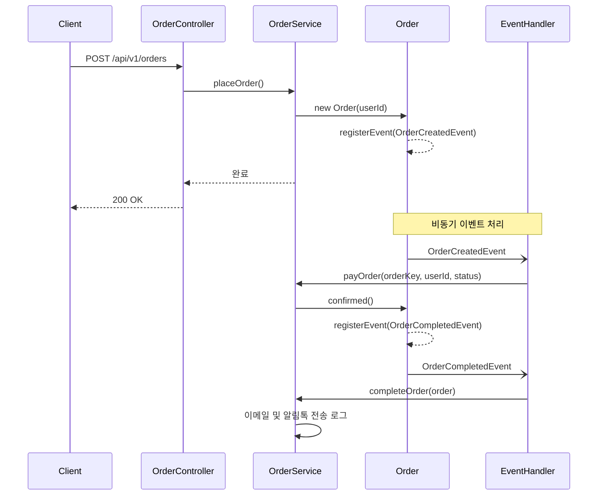

## ACTION ITEM
- 어느 프로세스까지 묶어야 하는지 다시 고민해보기
  - 트랜잭션 범위는 적절한가?
  - 어떤 프로세스는 비동기로 해도 괜찮은가?
- 다른 이벤트 방식도 적용하기
  - DomainEvents
  - ApplicationEventPublisher
- '배송 시작'도 추가하기
  - 이건 단순 이벤트 적용이 아니라 어느 시점에 처리해야 하는지 고민해보기
  - 더 나아가서 재고 차감, 가게에 주문 알림 등 다양한 상황들 생각해보기

---

## Order Process
- 1: 2024/08/09 00:29

